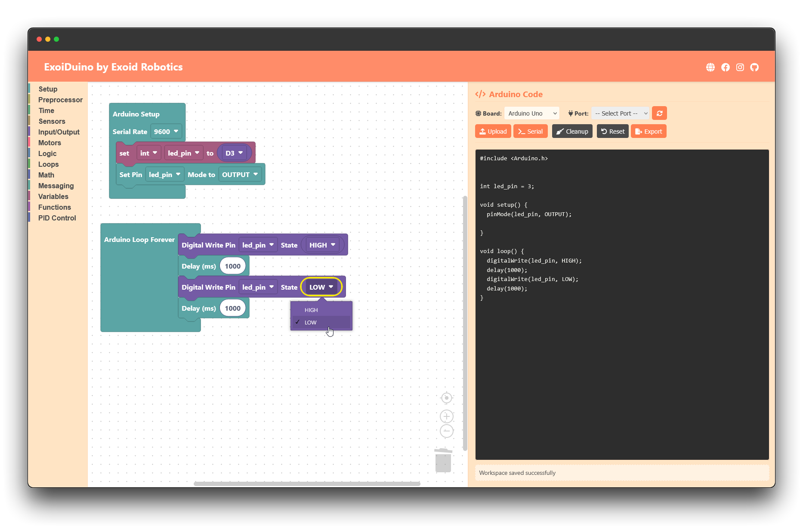
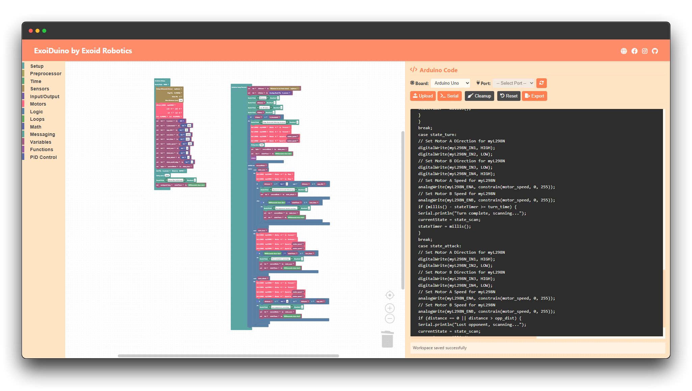

# ExoiDuino Blocks

<div align="center">
  
  <p><em>Simple configuration example: Basic LED blinking with delay</em></p>
</div>

## 🚀 Overview

ExoiDuino Blocks is a web-based visual programming environment for Arduino, making it easy for beginners to learn programming while providing advanced features for experienced users. Create Arduino sketches using drag-and-drop blocks, similar to Scratch but specifically designed for Arduino development.

## ✨ Features

- 🎨 **Visual Block Programming**: Drag-and-drop interface for Arduino programming
- 🔌 **Arduino-Specific Blocks**: 
  - Digital & Analog I/O
  - Serial Communication
  - Time Functions
  - Motor Controls (DC, Servo, Stepper)
  - Sensor Integration
  - PID Control
- 🛠️ **Advanced Features**:
  - Custom Function Creation
  - Variable Management
  - Preprocessor Directives
  - Switch/Case Statements
- 📝 **Real-time Code Generation**: See your blocks converted to Arduino code instantly
- 🔄 **Code Export**: Save your sketches as .ino files

## 🌟 From Simple to Complex

ExoiDuino Blocks scales with your needs:

### Simple Projects
Perfect for beginners starting with basic Arduino concepts:
- LED control
- Button inputs
- Simple sensor readings
- Basic motor control

### Complex Projects
Powerful enough for advanced applications:

<div align="center">
  
  <p><em>Complex configuration example: Advanced motor control with sensor feedback and PID</em></p>
</div>

## 🚀 Getting Started

1. **Clone the Repository**
   ```bash
   git clone https://github.com/yourusername/exoiduinoblocks.git
   cd exoiduinoblocks
   ```

2. **Open in Browser**
   - Open `index.html` in your web browser
   - No server required! Works completely client-side

3. **Start Building**
   - Drag blocks from the toolbox
   - Connect them to create your program
   - Export the generated code to Arduino IDE

## 🔧 Block Categories

- **Setup**: Arduino initialization and pin configuration
- **Input/Output**: Digital and analog I/O operations
- **Time**: Delays and timing functions
- **Motors**: DC, Servo, and Stepper motor controls
- **Sensors**: Various sensor integration blocks
- **Logic**: Control flow and decision making
- **Math**: Mathematical operations and calculations
- **Functions**: Custom function creation
- **Variables**: Variable management
- **Preprocessor**: #define and other directives
- **PID Control**: PID controller blocks

## 🤝 Contributing

Contributions are welcome! Please feel free to submit a Pull Request. For major changes, please open an issue first to discuss what you would like to change.

## 📄 License

This project is licensed under the MIT License - see the [LICENSE](LICENSE) file for details.

## 🙏 Acknowledgments

- Built with [Blockly](https://developers.google.com/blockly)
- Inspired by [Arduino](https://www.arduino.cc/) and [Scratch](https://scratch.mit.edu/)
- Special thanks to the open-source community

---
<div align="center">
  Made with ❤️ by Exoid Robotics
</div>

## File Structure

* `index.html`: The main HTML file for the user interface.
* `style.css`: Contains the CSS rules for styling (Pastel Orange theme).
* `app.js`: Main JavaScript file handling initialization, UI logic, base block definitions (Structure, IO, Time, Serial, Blink).
* `app_motors.js`: JavaScript file containing visual definitions for Motor blocks (L298N, Servo, Stepper).
* `app_sensor.js`: JavaScript file containing visual definitions for Sensor blocks (Light, Potentiometer, Ultrasonic, Encoder).
* `libs/generator/`: Folder containing JavaScript files for Arduino code generation logic, split by category:
    * `arduino_generator_init.js`: Core generator setup.
    * `structure.js`: Generators for `setup()` and `loop()`.
    * `logic.js`, `loops.js`, `math.js`, `text.js`, `variables.js`, `procedures.js`: Generators for standard Blockly categories.
    * `arduino_io.js`: Generators for standard Arduino Input/Output blocks.
    * `arduino_time.js`: Generators for Arduino time/delay blocks.
    * `arduino_serial.js`: Generators for Arduino serial communication blocks.
    * `sensors.js`, `ultrasonic.js`, `encoder.js`: Generators for sensor blocks.
    * `l298n.js`, `servo.js`, `stepper.js`: Generators for motor blocks.
    * `blink.js`: Generator for the custom blink block.

## How to Run

1.  **Clone the Repository:**
    ```bash
    git clone <your-repo-url>
    cd exoidduinoblocks
    ```
2.  **Open `index.html`:** Open the `index.html` file directly in a modern web browser that supports the Web Serial API (like Google Chrome or Microsoft Edge).

Alternatively, you can access the live version via GitHub Pages (if enabled): [https://riegojerey.github.io/exoidduinoblocks/](https://riegojerey.github.io/exoidduinoblocks/) (Replace with your actual GitHub Pages URL if different).

## Dependencies

* **Browser:** Requires a modern browser supporting Web Serial API for port connection features.
* **Arduino Libraries:** When using the generated code in the Arduino IDE or CLI, you will need to install the following libraries via the Arduino Library Manager:
    * `NewPing` (for Ultrasonic Sensor)
    * `Servo` (usually included with the IDE)
    * `Stepper` (usually included with the IDE)
    * `Encoder` (by Paul Stoffregen - commonly used for rotary encoders)

## Web Serial Limitations

The "Upload" button uses the Web Serial API to connect to the selected Arduino port. However, due to browser limitations:

* **This tool CANNOT compile the generated C++ code.**
* **This tool CANNOT directly upload (flash) the code to the Arduino board.**

**Workflow:**

1.  Use ExoiDuino to create your program with blocks.
2.  Click "Upload" to generate the code and verify the connection.
3.  Copy the generated code from the code preview area (or the browser's developer console).
4.  Paste the code into the Arduino IDE or save it as an `.ino` file for use with the Arduino CLI.
5.  Use the Arduino IDE or CLI to compile and upload the code to your connected board.

## Future Plans (Ideas)

* Improve UI/UX.
* Add more sensor and actuator blocks.
* Implement a Serial Monitor feature using Web Serial.
* Explore integration with Arduino CLI via a local agent or Electron wrapper for direct compilation and upload (more advanced).

